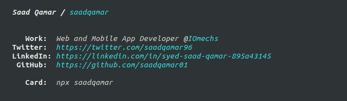

# [saadqamar](https://www.npmjs.com/package/saadqamar)

<center></center>

Having your own npm package is fun.

Created a [business card](https://www.npmjs.com/package/saadqamar) highly inspired by [ahsan_ayaz](https://twitter.com/Ahsan_ayz)'s idea he [shared on twitter](https://twitter.com/Ahsan_ayz/status/1076206995965992965).

Usage of `colorette` inspired by [mhartington](https://github.com/mhartington) because of zero dependencies.

Run below from your terminal.
```bash
npx saadqamar
```